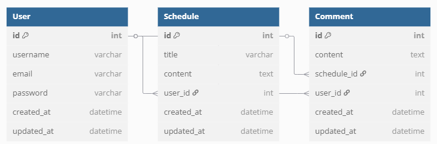

# ScheduleManagementAppUpgrade

# 📘 일정 관리 API 명세서

## 👤 유저 API

| 기능 | 메서드 | URL | 요청 예시 | 응답 예시 |
|------|--------|-----|-----------|-----------|
| 회원가입 | POST | `/api/users/signup` | `{ "username": "john", "email": "john@email.com", "password": "1234" }` | `201 Created` |
| 로그인 | POST | `/api/users/login` | `{ "email": "john@email.com", "password": "1234" }` | `200 OK` (Set-Cookie) |
| 유저 조회 | GET | `/api/users/{userId}` | - | `{ "id": 1, "username": "john", "email": "john@email.com" }` |
| 유저 목록 | GET | `/api/users` | - | `[ { "id": 1, "username": "john", "email": "john@email.com" } ]` |
| 유저 수정 | PUT | `/api/users/{userId}` | `{ "username": "johnny" }` | `200 OK` |
| 유저 삭제 | DELETE | `/api/users/{userId}` | - | `200 OK` |

## 📅 일정 API

| 기능 | 메서드 | URL | 요청 예시 | 응답 예시 |
|------|--------|-----|-----------|-----------|
| 일정 등록 | POST | `/api/schedules` | `{ "title": "공부하기", "content": "스프링 복습", "userId": 1 }` | `201 Created` |
| 일정 조회 | GET | `/api/schedules/{scheduleId}` | - | `{ "id": 1, "title": "공부하기", "content": "스프링 복습", "userId": 1 }`, `200 OK`, '404 NOT_FOUND' |
| 일정 목록 조회 | GET | `/api/schedules?page=0&size=10` | - | `[ ... ]` , `200 OK`, '404 NOT_FOUND'|
| 일정 수정 | PUT | `/api/schedules/{scheduleId}` | `{ "title": "운동하기", "content": "헬스장 가기" }` | `200 OK` |
| 일정 삭제 | DELETE | `/api/schedules/{scheduleId}` | - | `200 OK` |

## 💬 댓글 API

| 기능 | 메서드 | URL | 요청 예시 | 응답 예시 |
|------|--------|-----|-----------|-----------|
| 댓글 등록 | POST | `/api/schedules/{scheduleId}/comments` | `{ "content": "좋아요!", "userId": 1 }` | `201 Created` |
| 댓글 목록 | GET | `/api/schedules/{scheduleId}/comments` | - | `[ { "id": 1, "content": "좋아요!", "userId": 1 } ]` , `200 OK`, '404 NOT_FOUND' |
| 댓글 수정 | PUT | `/api/comments/{commentId}` | `{ "content": "수정된 댓글" }` | `200 OK` |
| 댓글 삭제 | DELETE | `/api/comments/{commentId}` | - | `200 OK` |

# ERD

