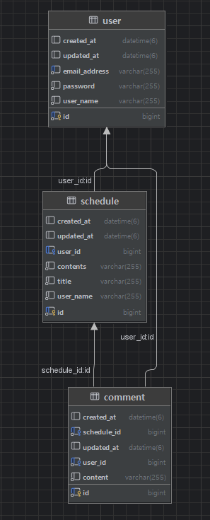

# Schedule Management App Upgrade (일정 관리 앱 업그레이드 버전)

Spring Boot와 Spring Security를 사용하여 사용자 일정 및 댓글을 관리하는 백엔드 애플리케이션입니다. 세션 기반 인증 및 인가를 통해 안전하게 데이터를 관리합니다.

## 1. 소개

본 프로젝트는 사용자가 개인 일정을 효과적으로 관리할 수 있도록 설계된 백엔드 애플리케이션입니다. 사용자는 회원가입, 로그인, 일정 생성, 조회, 수정, 삭제 기능을 이용할 수 있으며, 일정에 댓글을 추가할 수도 있습니다. 모든 사용자 데이터와 작업은 세션 기반 인증을 통해 안전하게 보호됩니다.

## 2. 주요 기능

*   **사용자 관리**:
    *   회원가입
    *   로그인 및 로그아웃
    *   내 정보 조회
    *   비밀번호 변경
    *   회원 탈퇴
*   **일정 관리**:
    *   새로운 일정 등록
    *   내 모든 일정 조회
    *   특정 일정 상세 조회 (ID 기반)
    *   기존 일정 수정 (비밀번호 확인 필요)
    *   일정 삭제 (비밀번호 확인 필요)
*   **댓글 관리**:
    *   일정에 댓글 추가
    *   특정 일정의 모든 댓글 조회
    *   자신의 댓글 수정 (비밀번호 확인 필요)
    *   자신의 댓글 삭제 (비밀번호 확인 필요)
*   **인증 및 인가**:
    *   Spring Security를 이용한 세션 기반 인증
    *   BCrypt를 사용한 비밀번호 암호화
    *   역할 기반 접근 제어 (모든 인증된 사용자는 암묵적으로 `ROLE_USER` 권한 보유)
    *   대부분의 API 엔드포인트에 대한 인증 요구
    *   일정 및 댓글 수정/삭제 시 소유권 확인
 
      

## 3. 사용 기술

*   **Java 17**
*   **Spring Boot 3.x**
*   **Spring Security 6.x**: 인증 및 인가 처리
*   **Spring Data JPA**: 데이터베이스 연동
*   **Hibernate**: JPA 구현체
*   **MySQL**: 관계형 데이터베이스
*   **Lombok**: 보일러플레이트 코드 감소
*   **Jakarta Validation**: 요청 DTO 유효성 검사

## 4. 프로젝트 구조

본 프로젝트는 표준 Spring Boot 계층형 아키텍처를 따릅니다:

*   `com.example.schedulemanagementappupgrade`
    *   `config`: 보안 설정 (예: `SecurityConfig.java`) 등 환경 설정 클래스 위치
    *   `controller`: HTTP 요청을 받아 서비스 계층으로 위임 (예: `UserController`, `ScheduleController`)
    *   `dto`: 데이터 전송 객체 (Request/Response DTO)
    *   `entity`: JPA 엔티티 (예: `User`, `Schedule`, `Comment`) - 데이터베이스 테이블과 매핑
    *   `exception`: 사용자 정의 예외 클래스 및 전역 예외 처리기 (`GlobalExceptionHandler.java`)
    *   `repository`: Spring Data JPA 리포지토리 (예: `UserRepository`) - 데이터베이스 접근 인터페이스
    *   `service`: 비즈니스 로직 구현 (예: `UserService`, `ScheduleService`)
 
    

## 5. 설정 및 실행 방법

### 사전 준비물

*   Java 17 JDK
*   MySQL Server

  

### 데이터베이스 설정

MySQL 서버가 실행 중인지 확인합니다. `src/main/resources/application.properties` 파일에서 데이터베이스 연결 정보를 설정합니다: `your_schedule_db_name`, `your_mysql_username`, `your_mysql_password`를 실제 데이터베이스 정보로 변경해주세요.

기본적으로 애플리케이션은 `8080` 포트에서 시작됩니다.

## 6. API 엔드포인트

모든 API 엔드포인트는 `/api` 접두사를 가집니다.

### 사용자 API (`/api/users`)

사용자 등록 및 프로필 관리를 담당합니다.

| HTTP 메서드 | 경로             | 설명                       | 요청 본문 DTO             | 응답 DTO / 상태        | 인증 필요 |
| :---------- | :--------------- | :------------------------- | :------------------------ | :--------------------- | :-------- |
| `POST`      | `/signup`        | 새 사용자 등록             | `UserCreationRequestDto`  | `UserCreationResponseDto` (201) | 아니요    |
| `GET`       | `/me`            | 현재 인증된 사용자 정보 조회 | -                         | `UserResponseDto` (200)  | 예        |
| `PATCH`     | `/me/password`   | 현재 사용자 비밀번호 변경  | `PasswordUpdateRequestDto`| 200 OK                   | 예        |
| `DELETE`    | `/me`            | 현재 사용자 계정 삭제      | `UserDeletionRequestDto`  | 204 No Content           | 예        |

### 일정 API (`/api/schedules`)

사용자 일정을 관리합니다. 인증이 필요합니다.

| HTTP 메서드 | 경로             | 설명                     | 요청 본문 DTO             | 응답 DTO / 상태                 |
| :---------- | :--------------- | :----------------------- | :------------------------ | :------------------------------ |
| `POST`      | `/`              | 새 일정 생성             | `ScheduleCreationRequestDto` | `ScheduleCreationResponseDto` (201) |
| `GET`       | `/`              | 현재 사용자의 모든 일정 조회 | -                         | `List<ScheduleResponseDto>` (200) |
| `GET`       | `/{scheduleId}`  | 특정 일정 상세 조회      | -                         | `ScheduleResponseDto` (200)     |
| `PATCH`     | `/{scheduleId}`  | 특정 일정 수정           | `ScheduleUpdateRequestDto`| 200 OK                          |
| `DELETE`    | `/{scheduleId}`  | 특정 일정 삭제           | `ScheduleDeletionRequestDto`| 204 No Content                  |

### 댓글 API (`/api/schedules/comments/{scheduleId}`)

일정에 대한 댓글을 관리합니다. 인증이 필요합니다.

| HTTP 메서드 | 경로             | 설명                     | 요청 본문 DTO             | 응답 DTO / 상태               |
| :---------- | :--------------- | :----------------------- | :------------------------ | :-------------------------------- |
| `POST`      | `/`              | 일정에 댓글 생성         | `CommentCreationRequestDto`| `CommentCreationResponseDto` (201)|
| `GET`       | `/`              | 특정 일정의 모든 댓글 조회 | -                         | `List<CommentResponseDto>` (200)  |
| `PATCH`     | `/{commentId}`   | 특정 댓글 수정           | `CommentUpdateRequestDto` | 200 OK                            |
| `DELETE`    | `/{commentId}`   | 특정 댓글 삭제           | `CommentDeletionRequestDto`| 204 No Content                    |

## 7. ERD

## 7. 보안 설정 (`SecurityConfig.java`)

Spring Security를 사용하여 보안을 설정합니다.

*   **인증**: 세션 기반. 로그인 성공 시 세션이 생성되고 `JSESSIONID` 쿠키가 설정됩니다.
*   **비밀번호 인코딩**: `BCryptPasswordEncoder`를 사용하여 사용자 비밀번호를 안전하게 저장합니다.
*   **인가**:
    *   `/api/users/signup` 및 `/api/auth/login` 경로는 공개적으로 접근 가능합니다.
    *   그 외 모든 `/api/**` 엔드포인트는 인증이 필요합니다.
*   **CSRF**: API 중심 애플리케이션을 위해 기본적으로 비활성화되어 있습니다 (필요시 활성화 가능).
*   **세션 관리**: `SessionCreationPolicy.IF_REQUIRED`를 사용하여 필요할 때만 세션을 생성합니다 (예: 로그인 후).
*   **로그아웃**: HTTP 세션을 무효화하고 `JSESSIONID` 쿠키를 삭제하도록 설정되어 있습니다.
*   **사용자 정의 UserDetails**: `UserDetailsServiceImpl`이 사용자별 데이터를 로드하고, `UserDetailsImpl`이 `User` 엔티티를 Spring Security의 `UserDetails`로 변환합니다. 모든 사용자는 `ROLE_USER` 권한을 부여받습니다.

  

## 8. 데이터베이스 스키마

애플리케이션은 `User`, `Schedule`, `Comment` 세 가지 주요 엔티티를 사용합니다. 모든 엔티티는 감사 정보(`createdAt`, `updatedAt`)를 위해 `BaseEntity`를 상속합니다.

*   **`User`**:
    *   `id` (Long, PK)
    *   `userName` (String, not null)
    *   `emailAddress` (String, not null, unique)
    *   `password` (String, not null, 암호화됨)
    *   `schedules` (`Schedule`과 OneToMany 관계, cascade remove)

*   **`Schedule`**:
    *   `id` (Long, PK)
    *   `userName` (String, not null - 응답 편의를 위해 User에서 비정규화)
    *   `title` (String, not null)
    *   `contents` (String, not null)
    *   `user` (`User`와 ManyToOne 관계)
    *   `comments` (`Comment`와 OneToMany 관계, cascade remove)

*   **`Comment`**:
    *   `id` (Long, PK)
    *   `content` (String, not null)
    *   `user` (`User`와 ManyToOne 관계)
    *   `schedule` (`Schedule`와 ManyToOne 관계)

*   **`BaseEntity` (MappedSuperclass)**:
    *   `createdAt` (LocalDateTime)
    *   `updatedAt` (LocalDateTime)
 
      

## 9. 예외 처리 (`GlobalExceptionHandler.java`)

`@RestControllerAdvice`를 사용하여 중앙 집중식 예외 처리 메커니즘을 구현합니다.

*   `UserNotFoundException`, `PasswordNotCorrectException`, `SameEmailExistException`, `ScheduleNotFoundException`, `CommentNotFoundException`, `AccessDeniedException`과 같은 사용자 정의 예외를 처리합니다.
*   `MethodArgumentNotValidException` (DTO 유효성 검사 실패 시)과 같은 표준 Spring 예외를 처리하여 상세한 필드 오류를 반환합니다.
*   응답 본문에 적절한 HTTP 상태 코드와 사용자 친화적인 오류 메시지를 제공합니다.
    *   `400 Bad Request`: 유효성 검사 오류, 잘못된 비밀번호, 이미 존재하는 이메일 등
    *   `401 Unauthorized`: 인증 실패 (Spring Security의 진입점에서 처리)
    *   `403 Forbidden`: 인가 실패
    *   `404 Not Found`: 리소스를 찾을 수 없음
    *   `500 Internal Server Error`: 일반적인 서버 측 예외
 
      

## 10. 주요 서비스 로직

*   **`UserService.java`**:
    *   사용자 생명주기 관리: 생성, 조회, 비밀번호 변경, 삭제.
    *   사용자 입력 유효성 검사, 이메일 주소 중복 확인, 비밀번호 검증.
    *   저장 전 비밀번호 암호화.

*   **`AuthService.java`**:
    *   `AuthenticationManager`를 통해 사용자를 인증하여 로그인 프로세스 처리.
    *   인증 성공 시, `SecurityContextHolder`에 `Authentication` 객체를 설정하고, `HttpSession`에 `SecurityContext`를 수동으로 저장.
    *   _참고: 표준 Spring Security 설정에서 `HttpSessionSecurityContextRepository`가 활성화된 경우, 프레임워크는 종종 `AuthenticationManager` 성공 후 자동으로 `SecurityContext`를 세션에 저장합니다. `AuthService`에서의 수동 세션 속성 설정은 이 프로젝트에서 명시적으로 취한 단계입니다._

*   **`ScheduleService.java`**:
    *   일정에 대한 CRUD 작업 제공.
    *   사용자가 자신의 일정만 관리할 수 있도록 보장 (소유권 확인).
    *   일정 수정 또는 삭제 시 비밀번호 확인 요구.

*   **`CommentService.java`**:
    *   댓글에 대한 CRUD 작업 제공.
    *   댓글이 유효한 일정 및 사용자와 연결되도록 보장.
    *   댓글 수정 및 삭제 시 댓글 소유권 확인.
    *   댓글 수정 또는 삭제 시 비밀번호 확인 요구.

*   **`UserDetailsServiceImpl.java`**:
    *   Spring Security의 `UserDetailsService` 인터페이스 구현.
    *   `UserRepository`에서 이메일 주소(사용자 이름으로 사용)로 사용자를 로드.
    *   `User` 엔티티를 래핑하는 `UserDetailsImpl` 객체 반환.

---

